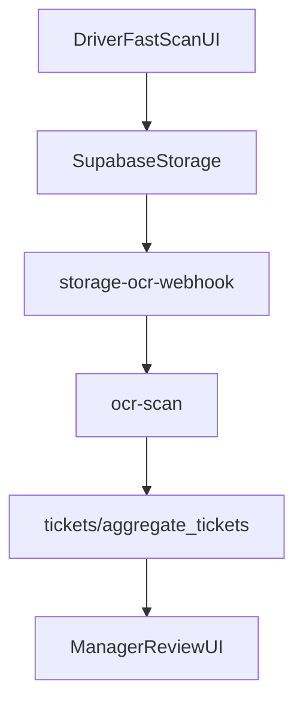

# Modular TMS Overview and Backlog

## Product intent
Build a transportation management system (TMS) with subscription-based modules. Key focus areas include:
- Ticket capture and OCR for pits/scale houses.
- Error detection and reconciliation between tickets, pit invoices, and payroll.
- Reliable data entry and correction workflows for exceptions.

## Architecture overview
- Frontend uses Next.js App Router with a global layout and providers.
- Authentication and data access are handled via Supabase (server and client).
- Feature areas are organized under `app/` routes and `app/api/` endpoints.

Key entry points:
- `app/page.tsx` provides the public landing/marketing flow.
- `app/layout.tsx` sets up global providers and branding by domain.
- `app/middleware.ts` is intended to gate routes (currently shows mixed logic).
- `app/api/_supabase.ts` and `app/lib/supabase*` provide server/client helpers.

## Subscription and modularity
Current structures supporting subscriptions and add-ons:
- `app/api/admin/plan/route.ts` reads/writes a basic plan tier (`Basic`, `Pro`, `Enterprise`).
- `db/migrations/035_account_plan.sql` seeds `account_plan` (single-tenant model).
- `supabase/migrations/20251123_billing_subscription_sales.sql` defines multi-tenant
  billing tables (`organizations`, `billing_addons`, `subscription_history`, etc.).
- `supabase/migrations/20251123_renewal_automation.sql` defines renewal automation.
- `app/pricing/page.tsx` shows plan tiers and uses `/api/admin/plan`.
- `app/customer-portal/page.tsx` includes feature gating using `payments.addons`.

Implication: plan/feature gating exists in several places but is not yet unified
into a single module registry or entitlement check.

## Ticket capture and OCR flow (pits / scale houses)
Main flows discovered:
- Driver one-tap scan: `app/driver/fastscan/page.tsx`
  - Creates a ticket row, uploads image to Supabase Storage, then listens for OCR completion.
- Company Fast Scan portal: `app/company/[company]/fast-scan/page.tsx`
  - CSV upload for bulk pit tickets and a UI for manual review and export.
- Fast Scan scanner flow (kiosk-style):
  - `app/fastscan/[organization_code]/page.tsx` (driver lookup)
  - `app/fastscan/[organization_code]/ticket/[driver_uuid]/page.tsx` (multi-step entry)
  - `app/api/fastscan/tickets/create/route.ts` (creates ticket records)
- OCR processing:
  - `app/supabase/functions/storage-ocr-webhook/index.ts` listens to storage events
    and calls OCR.
  - `app/supabase/functions/ocr-scan/index.ts` runs OCR with Google Vision and
    dispatches to ticket/HR handlers.
- Ticket anomaly analysis:
  - `app/api/intelligence/tickets/analyze/route.ts` scores anomalies.

Mermaid overview of ticket scan:

## Reconciliation and data entry workflows
Existing pieces:
- CSV mapping UI for pit ticket reconciliation:
  - `app/reconciliation/upload-csv/page.tsx` uploads CSV and previews mapping.
  - Uses `lib/csv/headerAnalyzer` for column detection.
  - Note: API route `/api/reconciliation/upload-csv` is referenced but missing.
- Ticket reconciliation endpoint:
  - `app/api/tickets/reconcile/route.ts` reconciles ticket data and updates records.
- Manager review and edits:
  - `app/admin/review-tickets/page.tsx` provides approve/deny/reassign/edit flows.
  - `app/api/admin/review-ticket/route.ts` persists edits and recalculates totals.
- Status updates:
  - `app/api/tickets/update-status/route.ts` updates `aggregate_tickets.status`.

Data entry correction points:
- Manual edits during manager review (`edit` action).
- CSV mapping UI (planned confirmation and save of pit formats).
- FastScan ticket wizard (manual entry for weights, ticket number, plant, material).

## Gaps observed (useful for backlog)
- No unified module entitlement service; plan gating is scattered.
- `app/reconciliation/upload-csv` lacks the backend API route it calls.
- Multiple ticket scanning entry points do not share a single validation/recon pipeline.
- Some Fast Scan routes use placeholder/mock storage behavior.

## Prioritized feature backlog (epics and user stories)
Priority labels:
- P0 = critical to subscription + ticket + reconciliation core
- P1 = important but can follow P0
- P2 = nice-to-have / incremental

### Epic 1: Subscription-based modules and entitlements (P0)
- P0: Define a single source of truth for entitlements (plan + addons).
- P0: Gate module access by org and user seat in UI and API.
- P1: Admin UI to manage modules per org (enable/disable addons).
- P1: Billing history visibility and audit trail per org.

### Epic 2: Ticket scanning and OCR pipeline (P0)
- P0: Standardize ticket ingestion for image and CSV sources.
- P0: Persist OCR results with confidence and raw text for audit.
- P0: Expose ticket status pipeline: pending, needs_review, reconciled.
- P1: Add error states and retry handling for OCR failures.

### Epic 3: Reconciliation and anomaly detection (P0)
- P0: Implement missing `/api/reconciliation/upload-csv` to parse and map pit CSVs.
- P0: Match pit tickets to internal tickets and generate reconciliation results.
- P0: Store reconciliation result set for audit and payroll export.
- P1: Apply anomaly scoring rules at reconciliation time and surface in UI.

### Epic 4: Data entry and correction flows (P0)
- P0: Data entry screen for missing fields (driver, truck, material, weights).
- P0: Manager review workflow to approve/deny and edit tickets.
- P1: Bulk correction tools for high-volume exceptions.
- P2: Guided validation rules (material codes, plant lists, weight tolerances).

### Epic 5: Pits and scale house operations (P1)
- P1: Manage pit/plant master data and scale house users.
- P1: CSV format templates per pit with reusable mappings.
- P2: Real-time pit activity dashboard (loads, exceptions, reconciliation status).

## Suggested next steps
1. Decide the canonical entitlement model (account_plan vs organizations/addons).
2. Implement the missing reconciliation API route to unblock CSV workflows.
3. Consolidate ticket status/review logic across Fast Scan and aggregates tickets.
